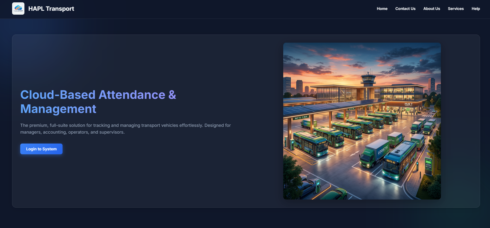
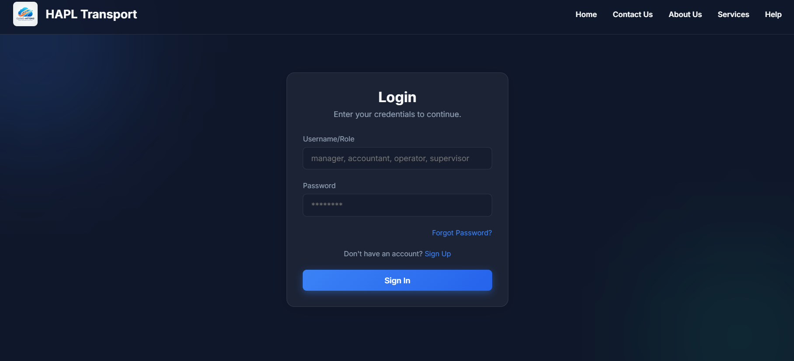
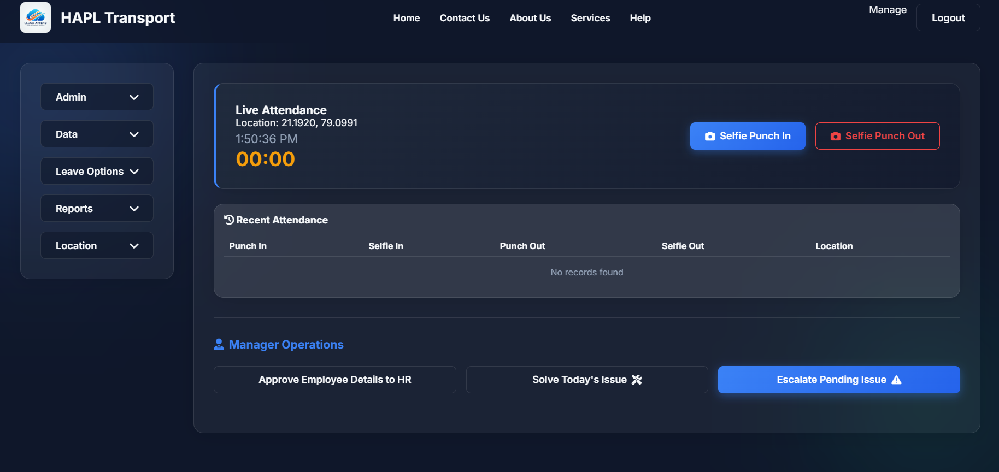

# Transport Vehicle App

The Transport Vehicle App is a full-stack web application designed to manage employee attendance, authenticate users across different roles, and provide a dashboard with basic statistics. It features a modern, clean frontend paired with a fast, database-backed API.

## 🛠️ Architecture Overview

The project is structured into three main components:
1. **Backend (Python / FastAPI)**: Handles business logic, user authentication, and database operations.
2. **Frontend (HTML / CSS / JavaScript)**: A structured, vanilla web application that interfaces directly with the backend APIs.
3. **Database (MySQL)**: Stores persistent data like user attendance histories.

## 📂 Project Structure

```
HAPL/
├── backend/
│   ├── main.py            # Main application entry point & API routes (FastAPI)
│   ├── db.py              # MySQL Database connection and table initializations
│   ├── requirements.txt   # Python dependencies listed here
├── frontend/
│   ├── index.html         # Main dashboard and user interface structure
│   ├── styles.css         # Custom styling and layout using CSS
│   └── app.js             # Client-side logic and API integration
├── assets/                # Static assets (images, icons, etc.)
└── .gitignore             # Ignored files for version control
```

## 🚀 Key Features and Capabilities

### 1. User Authentication System
- Supports multi-role authentication (`manager`, `supervisor`, `accounting_incharge`, `computer_operator`).
- API endpoints for `/api/signup` and `/api/login`.
- Dynamically assigns roles during login based on configurations.

### 2. Location-based Attendance System
- **Punch-In/Out Interface:** Employees can record their start and end times dynamically.
- **Selfie Captures:** The application requires camera access to attach a photo (selfie) to the database along with the punch.
- **Location Tracking:** Captures real-time geographical coordinates upon punching in/out and saves them to the backend.

### 3. Analytics & Dashboard Metrics
- **Attendance History:** `/api/attendance/history` tracks and displays the last 10 punch-in/out instances for users.
- **Admin Stats:** Endpoint for displaying leave balances, daily spendings, and active vehicles.

## 💻 Tech Stack Setup
- **Frameworks:** FastAPI (Backend), Custom Vanilla Web (Frontend)
- **Database:** MySQL
- **Dependencies:** `fastapi`, `uvicorn`, `pydantic`, `mysql-connector-python`

## 🏃🏿‍♂️ Running the Application

1. Make sure you have the required dependencies:
   ```bash
   cd backend
   pip install -r requirements.txt
   ```
2. Setup your database locally and adjust `db.py` to point to it.
3. Start the FastAPI server:
   ```bash
   python main.py
   # Alternatively: uvicorn main:app --host 127.0.0.1 --port 8001
   ```
4. Access the application in your browser at `http://127.0.0.1:8001`.

---

## 📸 Project Previews & Output

Here is what the application looks like in action. *(Note: Save your images to the `assets/` folder and name them as shown below, or update the filenames in this file to perfectly match!)*

### Homepage Preview
<div align="center">
  
</div>

### User Login Options
<div align="center">
  
</div>

### Manager & Live Attendance Dashboard
<div align="center">
  
</div>

